```mermaid
classDiagram
  class Notifier {
    +send(to: str, subject: str, body: str): None
  }
  <<interface>> Notifier

  class EmailNotifier {
    +send(to: str, subject: str, body: str): None
  }
  class SMSNotifier {
    +send(to: str, subject: str, body: str): None
  }
  class ReportService {
    +send_report(email: str, text: str): None
  }

  EmailNotifier ..|> Notifier
  SMSNotifier ..|> Notifier
  ReportService --> Notifier : depende de abstracción
```

# Protocolos + DI/DIP — Desacoplar notificaciones

**Objetivo:** mostrar cómo un **Protocol** (`typing.Protocol`) permite depender de **contratos ligeros** (por forma) para desacoplar servicios de sus detalles.


---

## 🔴 ANTES (acoplado a una clase concreta)

```python
# protocol_demo.py (versión ANTES)
class EmailNotifier:
    def send(self, to: str, subject: str, body: str) -> None:
        print(f"[EMAIL] {subject} → {to}: {body}")

class ReportService:
    def __init__(self) -> None:
        #  acoplado: crea el detalle concreto
        self.notifier = EmailNotifier()

    def send_report(self, email: str, text: str) -> None:
        self.notifier.send(email, "Reporte", text)

if __name__ == "__main__":
    svc = ReportService()
    svc.send_report("ana@acme.com", "Hola")
````

**Diagrama (ANTES)**


---

## 🟢 DESPUÉS (Protocol + DI + DIP)

```python
# protocol_demo.py (versión DESPUÉS)
from typing import Protocol

class Notifier(Protocol):
    def send(self, to: str, subject: str, body: str) -> None: ...

class EmailNotifier:
    def send(self, to: str, subject: str, body: str) -> None:
        print(f"[EMAIL] {subject} → {to}: {body}")

class SMSNotifier:
    def send(self, to: str, subject: str, body: str) -> None:
        print(f"[SMS] {body} → {to}")

class ReportService:
    # DI: inyecta dependencia
    # DIP: depende de la ABSTRACCIÓN (Notifier)
    def __init__(self, notifier: Notifier) -> None:
        self.notifier = notifier

    def send_report(self, email: str, text: str) -> None:
        self.notifier.send(email, "Reporte", text)

if __name__ == "__main__":
    svc = ReportService(EmailNotifier())   # prod
    # svc = ReportService(SMSNotifier())  # cambio trivial
    svc.send_report("ana@acme.com", "Hola")
```

**Diagrama (DESPUÉS)**



---

## Qué aprender aquí

* **Protocol** = contrato **estructural** (sin herencia).
* **DI** (inyectar) + **DIP** (depender de abstracciones) → reemplazos fáciles.

---

## Ejercicios

1. Crea `PushNotifier` con `send()` compatible y pruébalo en `ReportService`.
2. Escribe un doble de pruebas (`FakeNotifier`) que acumule mensajes y verifica que `send_report` envía lo esperado.
3. Cambia la firma de `Notifier` (agrega un campo) y observa cómo el *type checker* detecta implementaciones incompatibles.

---


# Clases Abstractas (ABCs) + DI/DIP — Repositorio de productos

**Objetivo:** aislar persistencia con una **ABC** (contrato nominal) y lograr que el servicio dependa de la abstracción, no de SQL u otra concreción.

---

## 🔴 ANTES (acoplado a SQL)

```python
# abc_repo_demo.py (versión ANTES)
from dataclasses import dataclass

@dataclass(slots=True)
class Product:
    id: int
    name: str
    price: float

class SqlProductRepo:
    def __init__(self, dsn: str) -> None:
        self.dsn = dsn
    def add(self, p: Product) -> None: ...
    def get(self, pid: int) -> Product | None: ...
    def list_all(self) -> list[Product]: return []

class ProductService:
    def __init__(self) -> None:
        # acoplamiento directo al detalle
        self.repo = SqlProductRepo("postgres://...")

    def create(self, pid: int, name: str, price: float) -> None:
        self.repo.add(Product(pid, name, price))

if __name__ == "__main__":
    svc = ProductService()
    svc.create(1, "Teclado", 20.0)
````

**Diagrama (ANTES)**


---

## 🟢 DESPUÉS (ABC + DI + DIP)

```python
# abc_repo_demo.py (versión DESPUÉS)
from dataclasses import dataclass
from abc import ABC, abstractmethod

@dataclass(slots=True)
class Product:
    id: int
    name: str
    price: float

class ProductRepository(ABC):
    @abstractmethod
    def add(self, p: Product) -> None: ...
    @abstractmethod
    def get(self, pid: int) -> Product | None: ...
    @abstractmethod
    def list_all(self) -> list[Product]: ...

class InMemoryProductRepo(ProductRepository):
    def __init__(self) -> None:
        self._data: dict[int, Product] = {}
    def add(self, p: Product) -> None:
        if p.id in self._data: raise ValueError("duplicado")
        self._data[p.id] = p
    def get(self, pid: int) -> Product | None:
        return self._data.get(pid)
    def list_all(self) -> list[Product]:
        return list(self._data.values())

class SqlProductRepo(ProductRepository):
    def __init__(self, dsn: str) -> None:
        self.dsn = dsn
    def add(self, p: Product) -> None: ...
    def get(self, pid: int) -> Product | None: ...
    def list_all(self) -> list[Product]:
        return []

class ProductService:
    # DIP: depende de la ABC
    # DI: inyectamos la implementación
    def __init__(self, repo: ProductRepository) -> None:
        self.repo = repo
    def create(self, pid: int, name: str, price: float) -> None:
        self.repo.add(Product(pid, name, price))

if __name__ == "__main__":
    svc = ProductService(InMemoryProductRepo())      # tests/dev
    # svc = ProductService(SqlProductRepo("postgres://..."))  # prod
    svc.create(1, "Teclado", 20.0)
    print([p.name for p in svc.repo.list_all()])
```

**Diagrama (DESPUÉS)**


---

## Qué aprender aquí

* **ABC** = contrato nominal + posibilidad de **lógica común** compartida.
* Con **DI + DIP**, el servicio **no** conoce detalles de persistencia.

---

## Ejercicios

1. Añade `update(p: Product) -> None` al contrato. Implementa en memoria y SQL.
2. Implementa `find_by_name(sub: str) -> list[Product]` con **list comprehension**.
3. Crea un decorador `LoggingRepo(ProductRepository)` que envuelva otro repo y loguee llamadas (patrón decorador).

---


# Combinado — ABC para estrategia + Protocolo para logging (DI + DIP)

**Objetivo:** usar **ABCs** donde hay **lógica común** (estrategias de precio) y **Protocolos** donde queremos **contratos ligeros** (logger), inyectando ambos en un servicio.


---

## 🔴 ANTES (acoplado a concreciones)

```python
# combined_demo.py (versión ANTES)
class ConsoleLogger:
    def log(self, msg: str) -> None:
        print("[LOG]", msg)

class TenPercentOff:
    def price_for(self, base: float) -> float:
        return base * 0.9

class CheckoutService:
    def __init__(self) -> None:
        # crea detalles concretos
        self.logger = ConsoleLogger()
        self.rule = TenPercentOff()

    def total(self, items: list[float]) -> float:
        t = sum(self.rule.price_for(x) for x in items)
        self.logger.log(f"total = {t}")
        return t

if __name__ == "__main__":
    svc = CheckoutService()
    print(svc.total([100, 50]))
```

**Diagrama (ANTES)**


---

## 🟢 DESPUÉS (ABC + Protocol + DI + DIP)

```python
# combined_demo.py (versión DESPUÉS)
from abc import ABC, abstractmethod
from typing import Protocol

# ABC: contrato + posible lógica común
class PricingRule(ABC):
    @abstractmethod
    def price_for(self, base: float) -> float: ...
    def apply_all(self, items: list[float]) -> list[float]:
        return [self.price_for(x) for x in items]

class TenPercentOff(PricingRule):
    def price_for(self, base: float) -> float:
        return base * 0.9

class Flat5(PricingRule):
    def price_for(self, base: float) -> float:
        return base - 5

# Protocolo: contrato ligero
class Logger(Protocol):
    def log(self, msg: str) -> None: ...

class ConsoleLogger:
    def log(self, msg: str) -> None:
        print("[LOG]", msg)

class CheckoutService:
    # inyecta abstracciones (rule y logger)
    def __init__(self, rule: PricingRule, logger: Logger) -> None:
        self.rule = rule
        self.logger = logger

    def total(self, items: list[float]) -> float:
        t = sum(self.rule.apply_all(items))
        self.logger.log(f"total = {t}")
        return t

if __name__ == "__main__":
    svc = CheckoutService(TenPercentOff(), ConsoleLogger())   # prod
    # svc = CheckoutService(Flat5(), ConsoleLogger())         # cambiar regla
    print(svc.total([100, 50]))
```

**Diagrama (DESPUÉS)**


---

## Qué aprender aquí

* **Usa ABC** cuando hay **lógica común/plantilla** (ej. `apply_all`).
* **Usa Protocol** cuando solo necesitas un **contrato mínimo** (ej. `log`).

---

## Ejercicios

1. Implementa `ComboRule(PricingRule)` que combine varias reglas (usa `list[PricingRule]`).
2. Crea `FileLogger` (escribe en archivo) y pruébalo con `CheckoutService`.
3. Escribe pruebas con un `FakeLogger` que acumule mensajes y verifica el texto del `total`.
4. (Opcional) Agrega `@dataclass` a una entidad `CartItem` y crea `total(items: list[CartItem])`.

---


