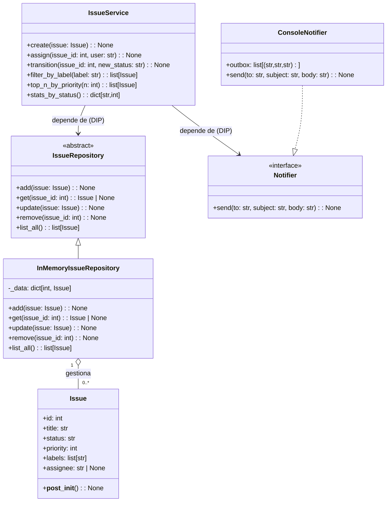
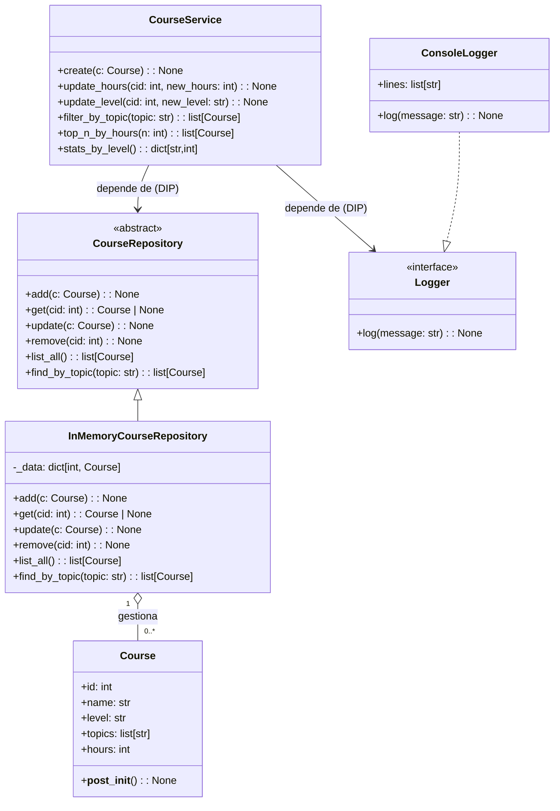

## IssueFlow — ABC + Protocol + DI/DIP

**Objetivo docente:** practicar **dataclasses**, **contrato nominal (ABC)**, **Protocol**, **DI + DIP**, y **comprehensions** implementando un mini *issue tracker*.

### Clases (exactamente 5)

1. `Issue` — entidad (`@dataclass`, `slots=True`)
2. `IssueRepository` — contrato (ABC)
3. `InMemoryIssueRepository` — implementación en memoria
4. `Notifier` — **Protocol** (contrato estructural)
5. `IssueService` — servicio (depende de las abstracciones)

---

## Enunciado (lo que debes construir)

### 1) Entidad `Issue`

Campos:

* `id: int`
* `title: str` (no vacío; `strip()`)
* `status: str = "open"` (permitidos: `"open" | "in_progress" | "closed"`)
* `priority: int = 3` (1=alta, 2=media, 3=baja)
* `labels: list[str] = []` (normalizar: `strip().lower()`, sin vacíos ni duplicados, preservando orden)
* `assignee: str | None = None`

Validaciones en `__post_init__`:

* `title` no vacío.
* `status` válido.
* `priority` ∈ `{1,2,3}`.
* Normalizar `labels` como se indica.

### 2) Contrato `IssueRepository` (ABC)

Métodos obligatorios:

* `add(issue: Issue) -> None`  (error si `id` duplicado)
* `get(issue_id: int) -> Issue | None`
* `update(issue: Issue) -> None` (error si no existe)
* `remove(issue_id: int) -> None` (error si no existe)
* `list_all() -> list[Issue]` (retorna copia)

### 3) Implementación `InMemoryIssueRepository`

* Almacén: `dict[int, Issue]`.
* Cumple reglas de duplicado/inexistente.

### 4) Protocolo `Notifier` + implementación `ConsoleNotifier`

* `Notifier.send(to: str, subject: str, body: str) -> None`.
* `ConsoleNotifier` debe **imprimir** y **acumular** en `outbox: list[tuple[str,str,str]]`.

### 5) Servicio `IssueService` (DIP + DI)

* `__init__(repo: IssueRepository, notifier: Notifier)`
* Casos de uso:

  * `create(issue)`: `repo.add`, notifica `"Issue creado"`.
  * `assign(issue_id, user)`: set `assignee`, `repo.update`, notifica.
  * `transition(issue_id, new_status)`: valida estado, actualiza y notifica.
  * `filter_by_label(label) -> list[Issue]`: **list comprehension** (minúsculas).
  * `top_n_by_priority(n) -> list[Issue]`: orden asc. por `priority`; corta a `n`.
  * `stats_by_status() -> dict[str,int]`: usa **dict comprehension** (`"open"`, `"in_progress"`, `"closed"`).

---

## Relaciones obligatorias (herencias/implementaciones)

* `IssueRepository` — **ABC**
  → **Debe ser heredada por** `InMemoryIssueRepository`, que **implementa todos** los métodos abstractos.

* `Notifier` — **Protocol**
  → **Debe ser implementada por** `ConsoleNotifier`, que **cumple la firma** `send(to, subject, body) -> None`.

* `IssueService` — **Servicio**
  → **Depende de las abstracciones**: constructor `__init__(repo: IssueRepository, notifier: Notifier)`.
  → **No** crea concreciones internamente (se inyectan).

```
IssueRepository (ABC)  <—hereda—  InMemoryIssueRepository
Notifier (Protocol)    <—cumple—  ConsoleNotifier
IssueService  ——depende de——>  IssueRepository + Notifier (DI/DIP)
```

---

## Diagrama (Mermaid)



---

## Demo esperada (ejemplo de uso)

```text
# Entradas:
create(Issue(1, "Configurar CI", labels=["DevOps","ci"], priority=1, assignee="ana"))
create(Issue(2, "Fix login", labels=["bug","auth"], priority=1))
assign(2, "luis")
transition(1, "closed")
filter_by_label("bug")
top_n_by_priority(2)
stats_by_status()

# Salidas aprox.:
[NOTIF] to=ana subj=Issue creado body=#1 - Configurar CI (p1)
[NOTIF] to=team subj=Issue creado body=#2 - Fix login (p1)
[NOTIF] to=luis subj=Asignación de issue body=Te asignaron #2: Fix login
[NOTIF] to=ana subj=Cambio de estado body=#1 → closed
filter_by_label("bug") -> ["Fix login"]
top_n_by_priority(2)   -> ["Configurar CI", "Fix login"]
stats_by_status()      -> {"open": 1, "in_progress": 1, "closed": 1}
outbox (len)           -> 4
```

---

## CourseFlow — ABC + Protocol + DI/DIP

### Clases

1. `Course` — entidad (`@dataclass`, `slots=True`)
2. `CourseRepository` — contrato (ABC)
3. `InMemoryCourseRepository` — implementación en memoria
4. `Logger` — **Protocol** (contrato estructural)
5. `CourseService` — servicio (depende de las abstracciones)

---

## Enunciado (lo que debes construir)

### 1) Entidad `Course`

Campos:

* `id: int`
* `name: str` (normalizar: `strip()` + colapsar espacios; no vacío)
* `level: str` (solo `"beginner" | "intermediate" | "advanced"`)
* `topics: list[str] = []` (normalizar: `strip().lower()`, sin vacíos ni duplicados, preservando orden)
* `hours: int` (> 0)

Validaciones en `__post_init__`:

* `name` normalizado y no vacío.
* `level` válido.
* `hours > 0`.
* `topics` normalizados como se indica.

### 2) Contrato `CourseRepository` (ABC)

Métodos obligatorios:

* `add(c: Course) -> None` (error si `id` duplicado)
* `get(cid: int) -> Course | None`
* `update(c: Course) -> None` (error si no existe)
* `remove(cid: int) -> None` (error si no existe)
* `list_all() -> list[Course]`
* `find_by_topic(topic: str) -> list[Course]` (comparación minúsculas)

### 3) Implementación `InMemoryCourseRepository`

* Almacén: `dict[int, Course]`.
* Cumple reglas de duplicado/inexistente.
* `find_by_topic` usa **list comprehension** y minúsculas.

### 4) Protocolo `Logger` + implementación `ConsoleLogger`

* `Logger.log(message: str) -> None`.
* `ConsoleLogger` **imprime** y **acumula** en `lines: list[str]`.

### 5) Servicio `CourseService` (DIP + DI)

* `__init__(repo: CourseRepository, logger: Logger)`
* Casos de uso:

  * `create(c)`: `repo.add` y `log` `"Creado course #id: name (level, hours)"`.
  * `update_hours(cid, new_hours)`: valida `>0`, actualiza, `log`.
  * `update_level(cid, new_level)`: valida nivel permitido, actualiza, `log`.
  * `filter_by_topic(topic) -> list[Course]`: **list comprehension**.
  * `top_n_by_hours(n) -> list[Course]`: orden **desc.** por `hours`; corta a `n`.
  * `stats_by_level() -> dict[str,int]`: usa **dict comprehension** y hace `log` del dict.

---

## Relaciones obligatorias (herencias/implementaciones)

* `CourseRepository` — **ABC**
  → **Debe ser heredada por** `InMemoryCourseRepository`, que **implementa todos** los métodos abstractos (incluido `find_by_topic`).

* `Logger` — **Protocol**
  → **Debe ser implementada por** `ConsoleLogger`, que **cumple** la firma `log(message) -> None`.

* `CourseService` — **Servicio**
  → **Depende de las abstracciones**: constructor `__init__(repo: CourseRepository, logger: Logger)`.
  → **No** crea concreciones internamente (se inyectan).

```
CourseRepository (ABC)  <—hereda—  InMemoryCourseRepository
Logger (Protocol)       <—cumple—  ConsoleLogger
CourseService  ——depende de——>  CourseRepository + Logger (DI/DIP)
```

---

## Diagrama (Mermaid)



---

## Demo esperada (ejemplo de uso)

```text
# Entradas:
create(Course(1, "  Intro   Python ", "beginner", topics=["Basics","syntax","BASICS"], hours=20))
create(Course(2, "Estructuras de Datos", "intermediate", topics=["lists","dicts"], hours=30))
create(Course(3, "POO Avanzada", "advanced", topics=["oop","design"], hours=25))
update_hours(1, 24)
update_level(1, "intermediate")
filter_by_topic("basics")
top_n_by_hours(2)
stats_by_level()

# Salidas aprox.:
[LOG] Creado course #1: Intro Python (beginner, 20h)
[LOG] Creado course #2: Estructuras de Datos (intermediate, 30h)
[LOG] Creado course #3: POO Avanzada (advanced, 25h)
[LOG] Horas actualizadas #1 → 24
[LOG] Nivel actualizado #1 → intermediate
filter_by_topic("basics") -> ["Intro Python"]
top_n_by_hours(2)        -> ["Estructuras de Datos", "POO Avanzada"]
[LOG] Stats nivel: {'beginner': 0, 'intermediate': 2, 'advanced': 1}
stats_by_level()         -> {'beginner': 0, 'intermediate': 2, 'advanced': 1}
lines (len)              -> 6
```

---
